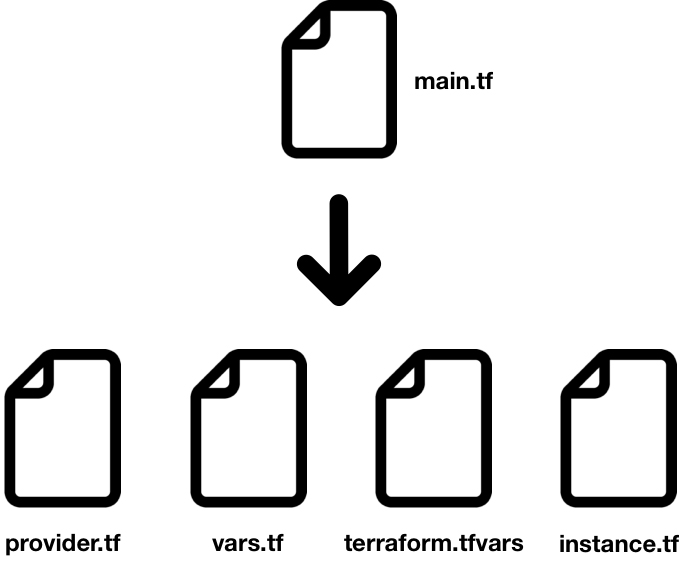

# Split files and use variables

## Prerequisites

Having completed labs 00, 01, 02, and 03. 

If you did not finish lab 03, you can take main.tf file in the solution folder.

## Connect to the Vagrant VM

Connect to the VM using ssh

```
$ cd <GIT_REPO_NAME>/vagrant
$ vagrant ssh
```

## Split main.tf



Connect to the VM using ssh

```
$ cd <GIT_REPO_NAME>/vagrant
$ vagrant ssh
```

Move to the right path and create your lab folder

```
vagrant@terraform-vm$ cd ~/$GIT_REPO_NAME/labs/04-Variables
```

Create a new directory for the project to live and create a main.tf file for the Terraform config. The contents of this file describe all of the GCP resources that will be used in the project.

```
vagrant@terraform-vm$ mkdir mylab
vagrant@terraform-vm$ cd mylab
vagrant@terraform-vm$ vi provider.tf
```

Put the following lines of code in provider.tf  (change values accordingly)

```
provider "google" {
 credentials = "${file("<CREDENTIALS_JSON_FILE>")}"
 project     = "<GCP_PROJECT_ID>"
 region      = "us-west1-a"
}
```

Put the following lines of code in instance.tf  

```

// Terraform plugin for creating random ids
resource "random_id" "instance_id" {
 byte_length = 8
}

// A single Google Cloud Engine instance
resource "google_compute_instance" "default" {
 name         = "my-vm-${random_id.instance_id.hex}"
 machine_type = "f1-micro"
 zone         = "us-west1-a"

 boot_disk {
   initialize_params {
     image = "debian-cloud/debian-9"
   }
 }

 network_interface {
   network = "default"

   access_config {
     // Include this section to give the VM an external ip address
   }
 }
 metadata = {
   ssh-keys = "<YOUR_VM_USERNAME>:${file("~/.ssh/id_rsa.pub")}"
 }
}
```

To verify the split, try terraform plan and apply again:

```
vagrant@terraform-vm$ terraform plan
Refreshing Terraform state in-memory prior to plan...
The refreshed state will be used to calculate this plan, but will not be
persisted to local or remote state storage.


------------------------------------------------------------------------

An execution plan has been generated and is shown below.
Resource actions are indicated with the following symbols:
  + create

Terraform will perform the following actions:

  # google_compute_instance.default will be created
  + resource "google_compute_instance" "default" {
      + can_ip_forward       = false
      + cpu_platform         = (known after apply)
      ...
```

# Use variables

Your provider.tf file now should figure as follows:

```
// Configure the Google Cloud provider
provider "google" {
 credentials = "${file("${var.CREDENTIAL_FILE}")}"
 project     = "${var.PROJECT_ID}"
 region      = "${var.REGION}"
}
```

In the instance.tf, change the following line:

```
        image = "debian-cloud/debian-9"
```

with

```
        image = "${lookup(var.IMAGE,var.REGION)}"
```

and 

```

   ssh-keys = "<YOUR_VM_USERNAME>:${file("~/.ssh/id_rsa.pub")}"

```

with

```
   ssh-keys = "${var.VM_USERNAME}:${file("~/.ssh/id_rsa.pub")}"
```


Now, create vars.tf file, where all the variables are declared (and defaults as well)


```
variable "CREDENTIAL_FILE" {}
variable "VM_USERNAME" {}
variable "PROJECT_ID" {}
variable "REGION" {
    default="us-west1-a"
}
variable "IMAGE" {
    type="map"
    default={
        "us-west1-a"="debian-cloud/debian-9"
        "us-west2-a"="debian-cloud/debian-8"
    }
}
```

In the same directory, create a fine named terraform.tfvars and put the values as follows (change the placeholders accordingly):

```
CREDENTIAL_FILE="<CREDENTIALS_JSON_FILE>"
PROJECT_ID="<GCP_PROJECT_ID>"
REGION="us-west1-a"
VM_USERNAME=<YOUR_VM_USERNAME>
```

Username within the VM instance will be your GCP email account, without the @domain.it part and with _ instead of .

For example, denis.maggiorotto@gmail.com will be denis_maggiorotto.


```
vagrant@terraform-vm$  terraform plan
Refreshing Terraform state in-memory prior to plan...
The refreshed state will be used to calculate this plan, but will not be
persisted to local or remote state storage.


------------------------------------------------------------------------

An execution plan has been generated and is shown below.
Resource actions are indicated with the following symbols:
  + create

Terraform will perform the following actions:

  # google_compute_instance.default will be created
  + resource "google_compute_instance" "default" {
      + can_ip_forward       = false
      + cpu_platform         = (known after apply)
      + deletion_protection  = false
      + guest_accelerator    = (known after apply)
      + id                   = (known after apply)
      + instance_id          = (known after apply)
      + label_fingerprint    = (known after apply)
      + machine_type         = "f1-micro"
      + metadata_fingerprint = (known after apply)
      + name                 = (known after apply)
      + project              = (known after apply)
      + self_link            = (known after apply)
      + tags_fingerprint     = (known after apply)
      + zone                 = "us-west1-a"

      + boot_disk {
          + auto_delete                = true
          + device_name                = (known after apply)
          + disk_encryption_key_sha256 = (known after apply)
          + source                     = (known after apply)

          + initialize_params {
              + image = "debian-cloud/debian-9"
```


